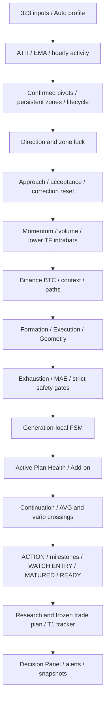

# Архитектура и границы точности

`reference/Scalping_SMA_1.15.2_price_scale_levels.pine` — неизменённый source of truth. `reference/task.ru.txt` — предоставленное пользователем ТЗ. Парсер читает весь исходник: 1 414 top-level statements, 54 функции, 2 UDT. Из него извлечены 323 inputs и 1 594 записи mapping переменных/локальных полей.

Python engine исполняет AST в исходном порядке. Это compatibility approach вместо независимого ручного переписывания тысяч формул. Он не является универсальным компилятором любого Pine: неподдержанная конструкция — ошибка, не пропущенный расчёт. Расчётные функции не заменяются TA-Lib. Drawing API поддерживает handles, а `f_dashRow` передаёт backend значения/цвета/подсказки интерфейсу; canvas frontend рисует представление.

## Сервисы

| Сервис | Назначение |
|---|---|
| engine | exchange adapters, backfill, WebSocket shards, source interpreter, checkpoints/snapshots |
| api | FastAPI, параметры, фильтрация, правила, история, WebSocket fanout |
| notifier | durable Telegram outbox, suppression, retry/delivery state |
| frontend | собранный React/TypeScript + nginx reverse proxy |
| postgres | PostgreSQL 17, SQLAlchemy typed columns + JSONB, Alembic |
| redis | pub/sub realtime; AOF persistence |
| retention | bounded archive/restore snapshots/events, preview по умолчанию |

Marketdata и engine объединены для последовательного доступа к state. Доменный engine не зависит от HTTP/ORM/Telegram. При масштабировании `ENGINE_SHARD_INDEX/COUNT` разбивает universe детерминированным hash; для полного покрытия должны быть запущены все shards. Redis lease с обновлением heartbeat разрешает только одного владельца каждого shard. Изменять shard count нужно с остановкой прежнего набора workers; автоматическое горизонтальное масштабирование не реализовано.

## Зависимости расчёта

Зоны хранятся как исходные persistent parallel arrays. Слияние возможно только с fresh ACTIVE zone; consumed/failure/break классификация не переосмысляется. Frozen plan и research UDT исполняются через исходные функции. `PINE READY` и `ACTIVE` не означают совершённую биржевую сделку — программа не отправляет торговых ордеров.

## Python модули

- `engine/syntax.py`: tokenizer, expressions, indentation blocks, UDT/function definitions.
- `engine/values.py`: NA, boolean semantics, арифметика, сериализация.
- `engine/interpreter.py`: scope/callsite history, state stores, source execution.
- `engine/contexts.py`: отдельные контексты request.security/security_lower_tf.
- `engine/parameters.py`: source-derived typed inputs, validation, warmup bound.
- `engine/runtime.py`: canonical result, provenance, полный analytic state.
- `engine/pine_compat/`: независимо тестируемые primitives.
- `marketdata/`: exchange interface, native REST/WS, timestamp aggregation, reconciliation.
- `models/`, `api/`, `alerts/`, `research/`: storage/application layers.

## Существенные ограничения

Совпадение синтаксического порядка не доказывает TradingView parity. Различия feeds, EMA initial history, barmerge, `ta.valuewhen` и tie cases требуют reference. History depth вычисляется консервативно; persistent зоны могут зависеть от более старой истории, чем любой конечный lookback. Начало replay обязательно входит в provenance.

BTC-контекст получает native Binance USD-M kline WebSocket updates. REST используется для начальной истории и восстановления пропусков; запоздавший REST response не перезаписывает более свежий WS sample. Health контролирует каждый requested BTC timeframe. Это не доказывает одинаковую последовательность updates с TradingView. Bybit kline updates имеют частоту своего native feed. FULL_REALTIME применяется лишь после полной наблюдаемой chart boundary для подписанных trades; historical 30S не изобретаются. Эти различия остаются предметом realtime acceptance.
